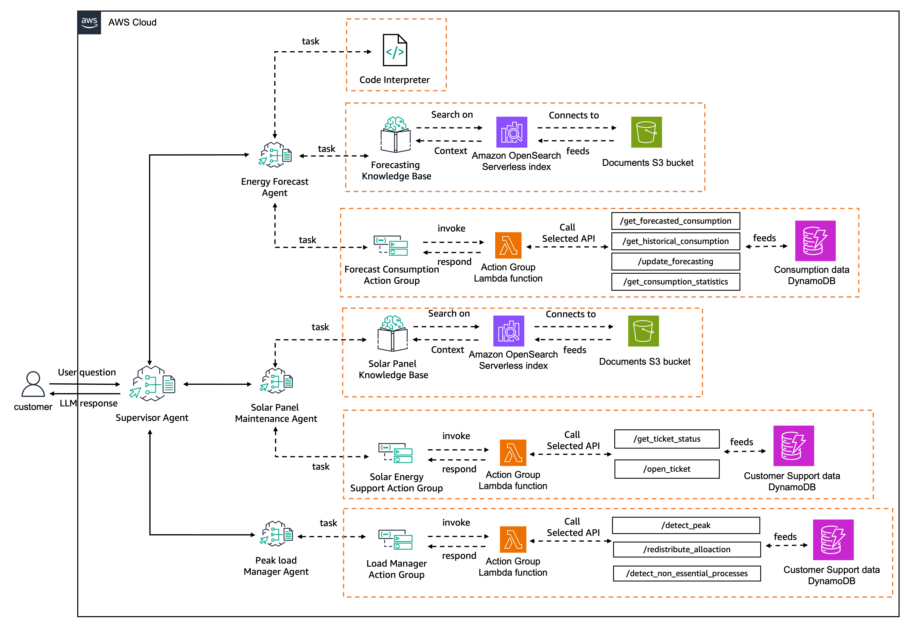
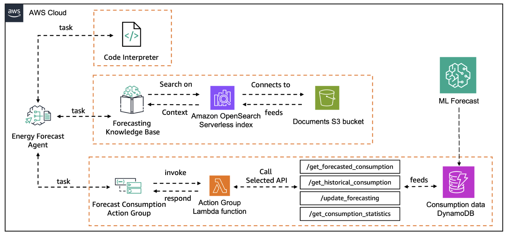

# Energy Efficiency Management System - Multi-Agent Workshop on CDK
This repository implements the [Energy Efficiency Management System - Multi-Agent Workshop](https://github.com/aws-samples/bedrock-multi-agents-collaboration-workshop) using AWS CDK.



## 1 Forecasting Agent
This agent is implemented in `/lib/constructs/1-energy-forecast.ts`.



After running `cdk deploy`, execute the script using the following command.
Python and boto3 are required.

```sh
% python preparation/1-energy-forecast/load_data_to_dynamodb.py
```